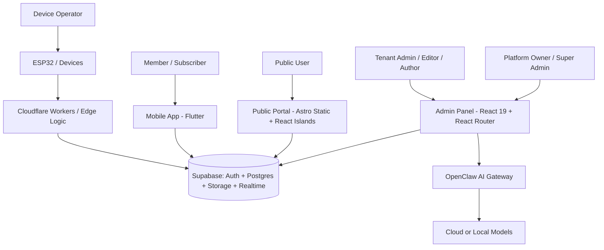
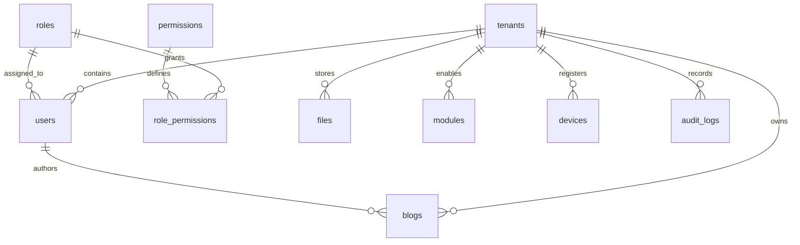

> **Documentation Authority**: [SYSTEM_MODEL.md](../../SYSTEM_MODEL.md) -> [AGENTS.md](../../AGENTS.md) -> [README.md](../../README.md) -> [DOCS_INDEX.md](../../DOCS_INDEX.md)

# AWCMS - Product Requirements Document (PRD)

> **Basis of this PRD:** current AWCMS repository state plus Context7-backed platform references for Supabase JS, Astro, React, and React Router.

## 1. Overview

AWCMS (Ahliweb Content Management System) is an AI-native, multi-tenant CMS platform for organizations that need one operational backend with strict tenant isolation and multiple delivery channels. The current repository shows four active client surfaces: a React admin panel, an Astro public portal, a Flutter mobile app, and ESP32-based IoT/device integrations, all centered on Supabase as the core backend.

The main problem AWCMS solves is fragmented digital publishing and operations: organizations need to manage content, users, branding, permissions, media, and delivery channels without mixing tenant data or building separate systems for web, mobile, and device use cases.

The product goal is to let each tenant operate an isolated workspace where platform operators can onboard tenants, tenant admins can configure modules and branding, editors and authors can manage content safely, and public users can consume published content through fast static portals and other connected channels.

## 2. Requirements

The product requirements at a minimal level are:

- **Multi-tenant by default:** All tenant-scoped business data must use `tenant_id`, Row Level Security, and soft delete rules.
- **Role-aware access:** The system must enforce ABAC permissions using `scope.resource.action` keys in both UI and database policy layers.
- **Content lifecycle support:** Core content must support draft, review, publish, archive, restore, and audit visibility.
- **Multi-channel delivery:** The same tenant content must be operable from the admin panel and publishable to the public portal, with optional mobile and IoT delivery paths.
- **White-label branding:** Each tenant must be able to control themes, settings, and module availability without breaking shared platform rules.
- **Compliance-ready operations:** Audit logs, consent-aware analytics, encrypted admin-only profile fields, and documented Indonesian compliance alignment must be part of the product baseline.
- **AI-assisted workflows:** The platform may accelerate drafting, translation, import, and automation, but AI output must stay tenant-scoped and human-reviewed before publish.

## 3. Core Features

The first-class product capabilities in the current AWCMS repository are:

1. **Platform and Tenant Management**
   - Platform owner and super admin can provision tenants, manage modules, and oversee system-wide operations.
   - Tenant admins manage users, roles, permissions, branding, languages, settings, and extensions within their own tenant scope.

2. **Content and Media Management**
   - Admin users can manage blogs, pages, visual pages, announcements, widgets, templates, portfolio items, services, team entries, and other tenant content modules.
   - Media features include file storage, photo galleries, and video galleries with tenant-aware isolation.
   - Visual editing uses Puck; rich text editing uses TipTap with sanitization safeguards.

3. **Workflow and Access Control**
   - Author, editor, admin, auditor, member, subscriber, and public roles have clearly separated responsibilities.
   - Permission checks exist in the admin UI and must be reinforced by Supabase RLS and `public.has_permission()` at the database layer.
   - Audit logs track important write activity for operational and compliance review.

4. **Public Experience and Publishing**
   - Public portals are built with Astro static output and React islands for fast, content-focused delivery.
   - Only published, non-deleted content is eligible for public rendering.
   - Tenant branding, SEO configuration, language settings, and analytics consent influence the public experience.

5. **Commerce, Communication, and Extensions**
   - The repository includes commerce modules such as products, product types, orders, promotions, and payment methods.
   - Email/newsletter and contact-related flows exist as tenant-facing capabilities.
   - The platform supports extension loading and a database-driven admin menu/resource model.

6. **AI, Mobile, and Device Channels**
   - OpenClaw provides tenant-isolated AI routing for assisted workflows.
   - Flutter supports mobile member/subscriber experiences.
   - ESP32 and device management modules support digital signage, configuration delivery, and other device-linked scenarios.

## 4. User Flow

The expected high-level flow across the product is:

1. **Platform Onboarding**
   - A platform operator creates a tenant, applies defaults, and invites the initial tenant admin.

2. **Tenant Setup**
   - The tenant admin configures branding, modules, languages, permissions, and site structure for that tenant.

3. **Content Production**
   - Authors create content as draft, editors review it, and authorized roles publish it when ready.

4. **Content Delivery**
   - Published content is built into the Astro public portal and may also be consumed by mobile and device clients when the tenant enables those channels.

5. **Monitoring and Governance**
   - Admins and auditors review audit logs, settings, permissions, visitor signals, and operational data to keep the tenant compliant and healthy.

## 5. Architecture

The current product architecture is:

**Architecture notes:**

- The admin panel is the main operational surface for content, settings, users, permissions, and modules.
- The public portal is a static-first delivery surface that reads published tenant content only.
- Supabase is the system of record for auth, database, storage, and realtime behavior.
- Cloudflare Workers handle edge logic and HTTP orchestration where needed.
- AI routing is tenant-aware and must not break tenant isolation.

## 6. Database Schema

The minimal product data model is:

| Table / Domain | Description |
| --- | --- |
| `tenants` | Master tenant record including slug/domain, hierarchy, and configuration baseline |
| `users` | Tenant-scoped user profiles linked to auth identities and roles |
| `roles`, `permissions`, `role_permissions` | ABAC model for UI and database enforcement |
| `blogs` and related content tables | Draft-to-publish content records owned by tenant and author |
| `files` | Tenant-scoped media and file assets |
| `modules` | Tenant-level feature activation and module lifecycle |
| `devices` | Device and IoT records bound to a tenant |
| `audit_logs` | Change history for operational accountability and compliance review |

**Data rules:**

- Tenant-scoped tables must carry `tenant_id`.
- Business data must use `deleted_at` for soft delete instead of hard delete.
- Public reads must exclude draft and soft-deleted data.
- The migration history in `supabase/migrations/` remains the executable schema source of truth.

## 7. Design & Technical Constraints

The product must operate within these repository-backed constraints:

1. **Technology Baseline**
   - Admin: React 19.2.4, Vite 7.2.7, JavaScript ES2022+.
   - Public: Astro 5.17.1, React 19.2.4 islands, TypeScript/TSX, static output.
   - Backend: Supabase + Cloudflare Workers.
   - Mobile/IoT: Flutter and ESP32 remain supported product channels.

2. **Security Rules**
   - RLS is mandatory for tenant-scoped data.
   - Client code must not bypass RLS.
   - Privileged operations may use `SUPABASE_SECRET_KEY` only in server-side edge contexts.
   - Sensitive profile/admin data must remain protected and encrypted where defined.

3. **Routing and Data Handling**
   - Admin routes use React Router patterns and secure route parameters for sensitive identifiers.
   - Public tenant resolution for static builds must come from build-time environment variables, not ad hoc runtime database access patterns.
   - All business reads must respect soft delete and permission boundaries.

4. **UI and Theming Rules**
   - White-label theming must use semantic CSS variables and Tailwind utility mapping.
   - Hardcoded brand colors are not acceptable for tenant-facing surfaces.
   - Shared admin UI should stay consistent with existing dashboard and shadcn/ui patterns.

5. **Explicit Non-Goals**
   - AWCMS is not a generic no-code SaaS builder.
   - AWCMS does not use custom Node.js application servers for core backend business logic.
   - AWCMS does not allow convenience exceptions that weaken tenant isolation, RLS, or auditability.

## References

- [SYSTEM_MODEL.md](../../SYSTEM_MODEL.md) - Authoritative architecture, versions, and security mandates
- [AGENTS.md](../../AGENTS.md) - Repository rules, Context7 references, and implementation patterns
- [README.md](../../README.md) - Monorepo overview and current runtime snapshot
- [DOCS_INDEX.md](../../DOCS_INDEX.md) - Canonical document routing
- [USER_STORY.md](USER_STORY.md) - Persona-driven flows
- [ACCEPTANCE_CRITERIA.md](ACCEPTANCE_CRITERIA.md) - Testable requirement checks
- [docs/modules/MODULES_GUIDE.md](../modules/MODULES_GUIDE.md) - Current admin module surface
- [docs/architecture/database.md](../architecture/database.md) - Schema orientation
- Context7 platform references: Supabase JS, Astro, React, and React Router documentation used to validate product surface assumptions
